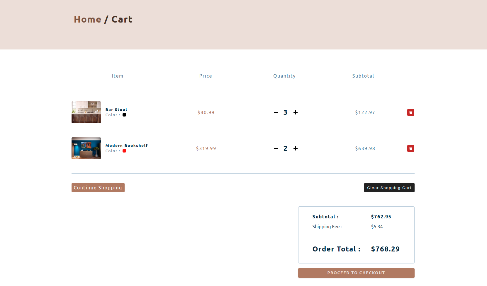

 # E-commerce Store

> 
Comfy Shop is a store project that uses the latest technologies to authorize and handle payments.





The project was created during the React 2020 course by John Smilga. All credit goes to him. [YT channel](https://www.youtube.com/c/CodingAddict)

## Built With

- React
- Netlify
- Auth0
- Stripe

## Live Demo

[Live Demo Link](https://comfy-shop-project.netlify.app/)


## Notes

#### Older React Version

```
"react": "^16.13.1",
"react-dom": "^16.13.1",
"react-scripts": "3.4.3",
```

#### Current React Version

```
"react": "^17.0.1",
"react-dom": "^17.0.1",
"react-scripts": "4.0.0",
```

#### Alternative fix

.env file in the root
FAST_REFRESH=FALSE
